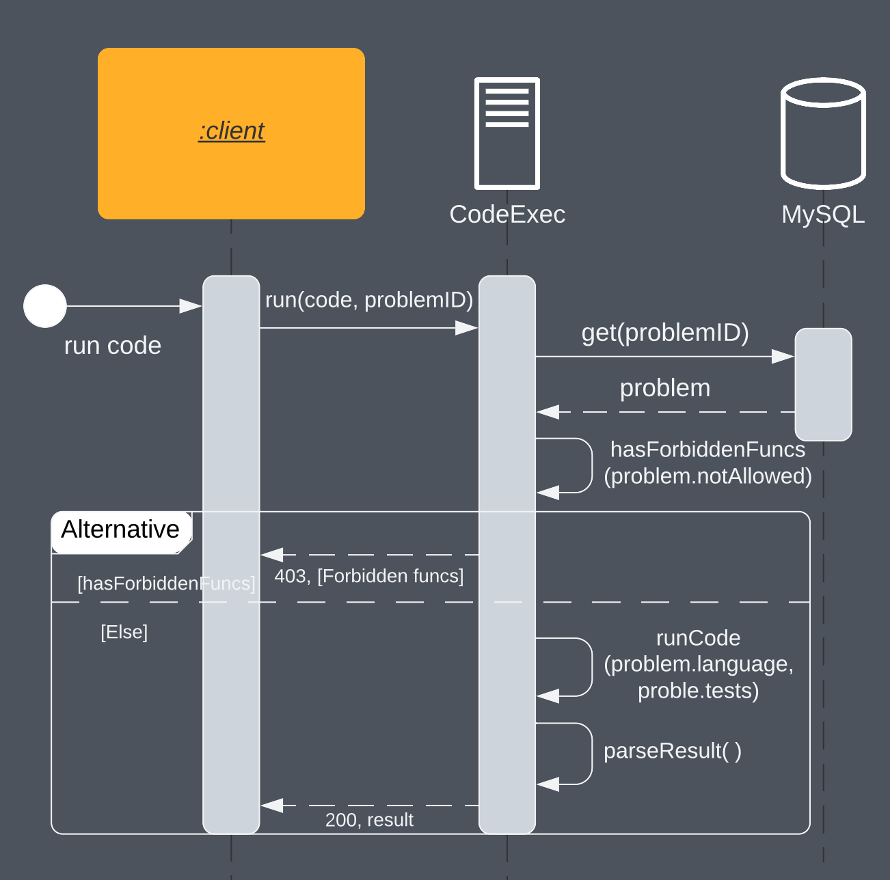

# CodeExec API

CodeExec es una REST API implementada en Go. Permite ejecutar y evaluar código de manera remota.

## URL Base

`34.16.137.250:8081`

## Endpoints

### `/exec`

#### Method

`POST`

#### Parametros
(Mediante el body de la peticion)

| Parameter | Type   | Requerido | Description                                     |
| --------- | ------ | --------- | ----------------------------------------------- |
| code      | string | si        | Código a ejecutar                               |
| id        | string | si        | ID del problema en MySQL                        |

#### Respuesta

La respuesta tiene formato JSON y contiene los siguientes campos

| Campo          | Tipo                       | Descripcion                                                                                 |
| -------------- | ---------------------      | -----------------------------------------------------------------                           |
| error          | string                     | Error generado al ejecutar el código, en caso de que no hayan errores es un string vacio    |
| shownTests     | [ map[string]string/bool ] | Casos de prueba visibles                                                                    |
| shownPassed    | int                        | Numero de casos de pruebas visibles que pasaron                                             |
| shownFailed    | int                        | Numero de casos de pruebas visibles que fallaron                                            |
| hiddenTests    | map[string]int             | Cantidad de casos de prueba no visibles que pasaron y fallaron                              |
| passed         | bool                       | Un booleano que indica si todas las pruebas (tanto las mostradas como las ocultas) pasaron. |

#### Ejemplo
**Peticion**
POST 34.16.137.250:8081
Content-Type: application/json

```
{
    "code": "x = input()\nprint(x.lower())",
    "id": "HQ000000000000000002"
}
```
**Respuesta**
HTTP/1.1 200 OK
Content-Type: application/json

``` json
{
    "error": "",
    "shownTests": [
        {
            "expected": "dan",
            "got": "dan",
            "input": "DaN",
            "passed": true
        },
        {
            "expected": "perez",
            "got": "perez",
            "input": "perEz",
            "passed": true
        }
    ],
    "shownPassed": 2,
    "shownFailed": 0,
    "hiddenTests": {
        "failed": 0,
        "passed": 2
    },
    "passed": true
}
```

## Respuestas de error
En caso de que se presente un error no relacionado con la ejecucion del código, se regresara un mensaje describiendo el error. 

| HTTP Status | Error Message                                    | Description                                                                                                 |
| ----------- | ------------------------------------------------ | ----------------------------------------------------------------------------------------------------------- |
| 400         | Error reading request body                       | No se proporcionaron todos los atributos necesarios, o nose cumple con el formato solicitado                |
| 403         | Found disallowed functions in code ({functions}) | El código recibido contiene funciones no permitidas, no se ejecutará                                        |   
| 500         | Error executing query                            | Problema relacionado con la ejecucion de la query, checar la consola de CodeExec para mas detalles          |
| 500         | Error executing code                             | Error al ejecutar código no relacionado directamente con este, probablemente le falta algo al ambiente en el que se ejecuto |
| 500         | Error parsing result                             | Error al "parsear" el output de la ejecucion del código, verificar que la query a ejecutar tenga el formato correcto |
| 500         | Error formatting response                        | Error al transformar el objeto de respuesta a un json, indica un error en la definición del struct `Result` |


## Funcionamiento
Esta API es un microservicio, ya que unicamente es capaz de ejecutar código y regresar los resultados. Como medida de seguridad ante inyecciones de código, cada ejecución es realizada en un contenedor de docker el cual es desechado después de su uso.


